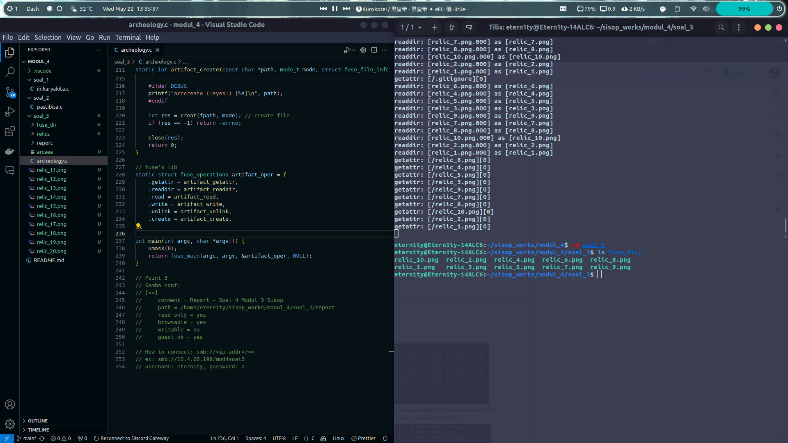
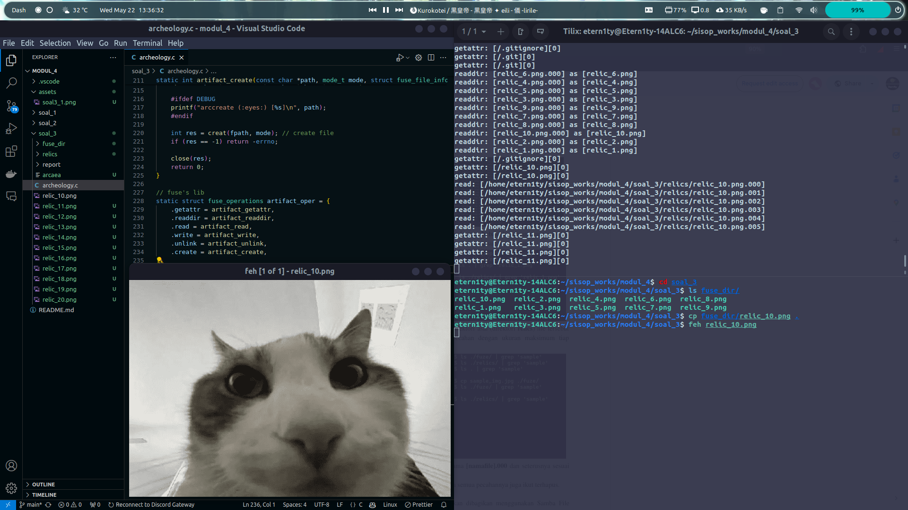
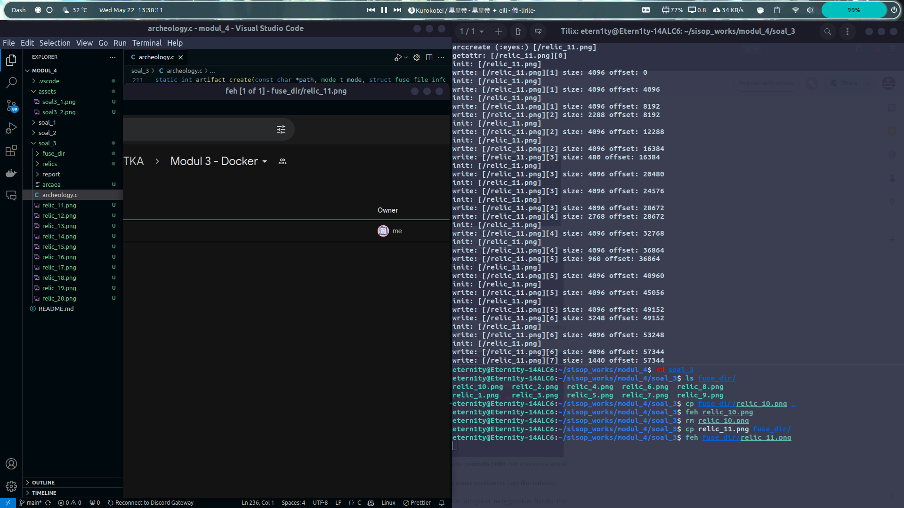
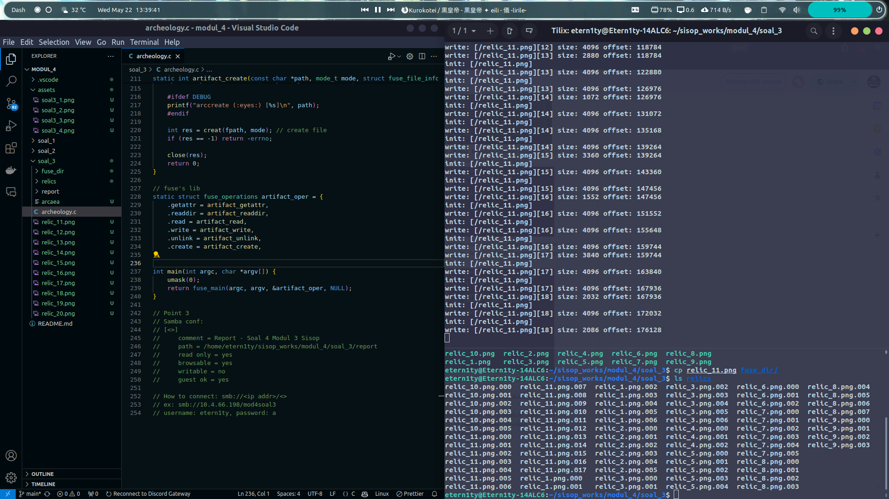
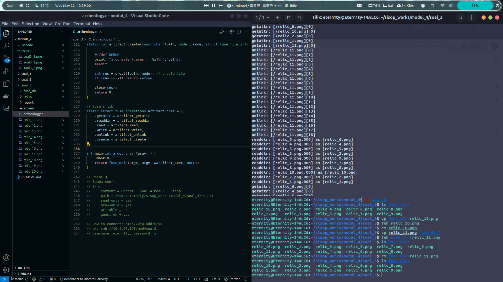
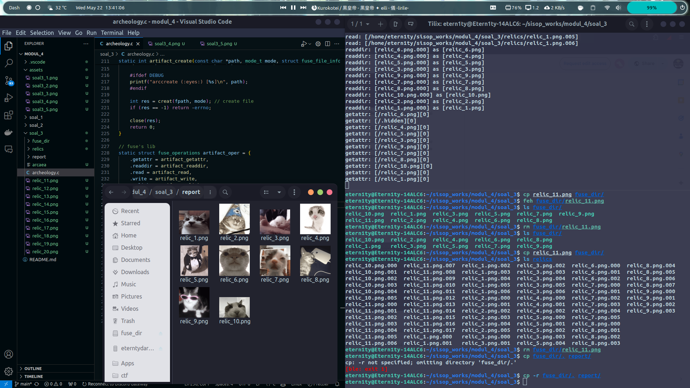
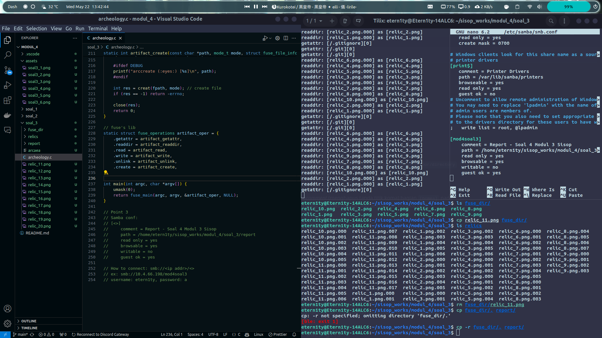
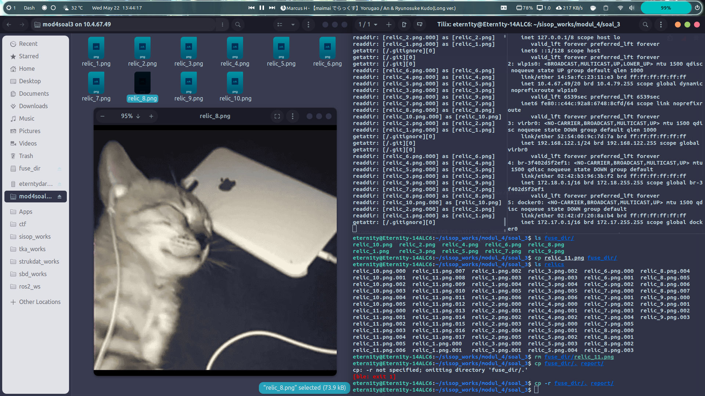

# Repository Praktikum Sistem Operasi Modul 3 - IT04
## Anggota

| Nama                      | NRP        |
|---------------------------|------------|
|Nathan Kho Pancras         | 5027231002 |
|Athalla Barka Fadhil       | 5027231018 |
|Muhammad Ida Bagus Rafi H  | 5027221059 |


## Daftar Isi

- [Soal 1](#soal-1)
- [Soal 2](#soal-2)
- [Soal 3](#soal-3)

# Soal 1

### Dikerjakan oleh Athalla Barka Fadhil (5027231018)

## Deskripsi Soal

### Catatan

## Pengerjaan

## Output

# Soal 2

### Dikerjakan oleh Muhammad Ida Bagus Rafi Habibie (5027221059)

## Deskripsi Soal

### Catatan

## Pengerjaan

## Output

# Soal 3

### Dikerjakan oleh Nathan Kho Pancras (5027231002)

## Deskripsi Soal
Seorang arkeolog menemukan sebuah gua yang didalamnya tersimpan banyak relik dari zaman praaksara, sayangnya semua barang yang ada pada gua tersebut memiliki bentuk yang terpecah belah akibat bencana yang tidak diketahui. Sang arkeolog ingin menemukan cara cepat agar ia bisa menggabungkan relik-relik yang terpecah itu, namun karena setiap pecahan relik itu masih memiliki nilai tersendiri, ia memutuskan untuk membuat sebuah file system yang mana saat ia mengakses file system tersebut ia dapat melihat semua relik dalam keadaan utuh, sementara relik yang asli tidak berubah sama sekali.

### Catatan

Directory tree:
```
.
├── fuse_dir
├── relics
│   ├── relic_1.png.000
│   ├── relic_1.png.001
│   ├── ...
│   └── relic_9.png.010
└── report
```

[nama_bebas] = fuse_dir

Define yang digunakan:

```c
// defines
#define _XOPEN_SOURCE 700 // for S_IFREG
#define FUSE_USE_VERSION 28 // fuse

// debug mode - printing and using foreground fuse with -f
#define DEBUG
```

Constants yang digunakan:

```c
static const char *dirpath = "/home/etern1ty/sisop_works/modul_4/soal_3/relics";
const int MAX_PATH = 1024;
const int PART_SIZE = 10000;
```

## Pengerjaan

> a. Buatlah sebuah direktori dengan ketentuan seperti pada tree berikut
```
.
├── [nama_bebas]
├── relics
│   ├── relic_1.png.000
│   ├── relic_1.png.001
│   ├── dst dst…
│   └── relic_9.png.010
└── report
```

Untuk [nama_bebas], saya memakai fuse_dir sebagai nama folder.

> b. Direktori [nama_bebas] adalah direktori FUSE dengan direktori asalnya adalah direktori relics. Ketentuan Direktori [nama_bebas] adalah sebagai berikut:
>> Ketika dilakukan listing, isi dari direktori [nama_bebas] adalah semua relic dari relics yang telah tergabung.

Pertama, agar FUSE sendiri bekerja untuk listing di fuse_dir, kita memerlukan beberapa fungsi, yaitu:
- getattr
- readdir

Untuk deklarasi fungsi didapatkan dari `fuse.h`.

**getattr**

```c
static int artifact_getattr(const char *path, struct stat *stbuf) {
    memset(stbuf, 0, sizeof(struct stat));

    if (strcmp(path, "/") == 0) {
        stbuf->st_mode = S_IFDIR | 0755; // all permissions for owner, read and execute for others
        stbuf->st_nlink = 2;
        return 0;
    }

    char fpath[MAX_PATH]; // full path
    sprintf(fpath, "%s%s", dirpath, path);

    stbuf->st_mode = S_IFREG | 0755; // same thing
    stbuf->st_nlink = 1;
    stbuf->st_size = 0;

    char part[MAX_PATH]; // path of divided file (parts)
    FILE *fp;
    
    int i = 0;

    #ifdef DEBUG
    printf("getattr: [%s][%d]\n", path, i);
    #endif

    while (1) {
        sprintf(part, "%s.%03d", fpath, i++); // looping through parts
        fp = fopen(part, "rb");
        if (!fp) break;

        fseek(fp, 0L, SEEK_END);
        stbuf->st_size += ftell(fp); // adds file size to the total size
        fclose(fp);
    }
    if (i == 1) return -errno;
    return 0;
}
```

Untuk getattr, pertama kita inisialisasi struct stbuf dan set mem ke 0, ditambah setting permissionsnya dengan S_IFREG dan mode 0755. Kita juga membuat fpath (full path) yang diambil dari dirpath dan path. Kemudian di main loop, kita loop semua part dari 000 (i = 0) sampai selesai menggunakan seek, dan menambahkan sizenya ke size total. 

**readdir**

```c
static int artifact_readdir(const char *path, void *buf, fuse_fill_dir_t filler, off_t offset, struct fuse_file_info *fi) {
    (void) offset;
    (void) fi;

    filler(buf, ".", NULL, 0); // skips cur dir
    filler(buf, "..", NULL, 0); // skips parent dir

    DIR *dp;
    struct dirent *de;
    dp = opendir(dirpath);
    if (dp == NULL) return -errno;

    while ((de = readdir(dp)) != NULL) {
        struct stat st;
        memset(&st, 0, sizeof(st));
        st.st_ino = de->d_ino;
        st.st_mode = de->d_type << 12;

        if (strstr(de->d_name, ".000") == NULL) continue; // skips if it isnt a file's part

        char relic[MAX_PATH];
        strcpy(relic, de->d_name);
        relic[strlen(de->d_name) - 4] = '\0'; // removes the ".000-.nnn" part
        
        #ifdef DEBUG
        printf("readdir: [%s] as [%s]\n", de->d_name, relic);
        #endif

        if (filler(buf, relic, &st, 0)) break;
    }
    closedir(dp);
    return 0;
}

```

Untuk readdir, pertama kita skip `.` dan `..` terlebih dahulu. Kemudian kita opendir ke dirpath, inisialisasi struct st dan set ke 0. 

Dilakukan iterasi atas semua entry di dir. Misal nama file yang di read tidak memiliki `.000`, maka skip sehingga file hanya ada 1 ketika dilakukan `ls`.  Setelah itu, kita rename / menghapus bagian .000 dengan melakukan `'\0'` di relic `(strlen(de->d_name) - 4)`. Iterasi akan terus dilakukan sampai semua entry diproses.

>> Ketika dilakukan copy (dari direktori [nama_bebas] ke tujuan manapun), file yang disalin adalah file dari direktori relics yang sudah tergabung.

Untuk melakukan copy, kita memerlukan fungsi lain, yaitu read.

**read**

```c
static int artifact_read(const char *path, char *buf, size_t size, off_t offset, struct fuse_file_info *fi) {
    (void) fi;
    char fpath[MAX_PATH]; 
    sprintf(fpath, "%s%s", dirpath, path); // full path

    // reading variables
    char part[MAX_PATH];
    size_t read_len;
    size_t read_size = 0;

    int i = 0;
    while (size > 0) {
        sprintf(part, "%s.%03d", fpath, i++); // looping through parts
        FILE *fp = fopen(part, "rb");
        if (!fp) break;

        #ifdef DEBUG
        printf("read: [%s]\n", part);
        #endif

        fseek(fp, 0L, SEEK_END); 
        size_t part_size = ftell(fp); // get the size of the part
        fseek(fp, 0L, SEEK_SET);

        if (offset >= part_size) { // skip if offset is larger than part's size
            offset -= part_size;
            fclose(fp);
            continue;
        }

        fseek(fp, offset, SEEK_SET);
        read_len = fread(buf, 1, size, fp); // read file
        fclose(fp);

        // buffer increases, size decreases, read_size increases for each iteration
        buf += read_len;
        size -= read_len;
        read_size += read_len;

        offset = 0;
    }
    return read_size;
}
```

Untuk read, setelah deklarasi path, ada loop while yang berjalan selama `size > 0`. Di setiap iterasi yang dilakukan, fungsi membuat part untuk setiap file yang dibaca.

Kemudian kita mendapat part_size melalui seeking ke fp. Misal `offset >= part_size` maka kita skip dan mengurangi offset berdasarkan part_size.

Jika offset lebih kecil dari part_size, maka kita menggeser posisi seek ke offset dan membaca dari buf. File ditutup, dan dilakukan penambahan buf dan read_size dengan read_len, dan juga pengurangan size dengan read_len. Fungsi mengembalikan read_size yaitu jumlah byte yang dibaca.

>> Ketika ada file dibuat, maka pada direktori asal (direktori relics) file tersebut akan dipecah menjadi sejumlah pecahan dengan ukuran maksimum tiap pecahan adalah 10kb.

Jika ada file baru yang di cp, dan kita memecahnya dengan ukuran max 10kb, kita memerlukan fungsi baru, yaitu:
- write
- create

**write**

```c
static int artifact_write(const char *path, const char *buf, size_t size, off_t offset, struct fuse_file_info *fi) {
    (void) fi;
    char fpath[MAX_PATH];
    sprintf(fpath, "%s%s", dirpath, path); // full path

    #ifdef DEBUG
    printf("init: [%s]\n", path);
    #endif
    
    // writing variables
    int cur_part = offset / PART_SIZE;
    size_t part_offset = offset % PART_SIZE;
    size_t write_size_total = 0;
    char part[MAX_PATH]; 

    while (size > 0) {
        sprintf(part, "%s.%03d", fpath, cur_part++); // looping through parts
        FILE *fp = fopen(part, "r+b");
        if (!fp) {
            fp = fopen(part, "wb");
            if (!fp) return -errno;
        }

        #ifdef DEBUG
        printf("write: [%s][%d] size: %ld offset: %ld\n", path, cur_part, size, offset);
        #endif

        fseek(fp, part_offset, SEEK_SET);
        size_t write_size;
        // find size    
        if (size > (PART_SIZE - part_offset)) write_size = PART_SIZE - part_offset; 
        else write_size = size;

        fwrite(buf, 1, write_size, fp); // write to the file
        fclose(fp);

        // buffer decreases, size decreases, write_size_total increases for each iteration
        buf += write_size;
        size -= write_size;
        write_size_total += write_size;
        part_offset = 0; // reset offset for next iteration
    }
    return write_size_total;
}
```

Untuk write, seperti biasa ada deklarasi path. Setelah itu, kita membuat beberapa variabel seperti cur_part, part_offset, part, dan write_size_total. 

Masuk ke fungsi while yang akan berjalan selama `size > 0`, di setiap iterasi, part = path ke bagian file yang akan diwrite (menggunakan r+b untuk read + write, wb = write). Kemudian, kita seek berdasarkan part_offset, dan menentukan write_size dengan cara:
- Misal `size > (PART_SIZE - part_offset))`  dimana `(PART_SIZE - part_offset))` adalah ruang yang tersisa dalam part file, `write_size = (PART_SIZE - part_offset))` atau ruang yang tersisa.
- Jika kondisi diatas tidak terpenuhi, maka `write_size = size`.

Setelah itu kita write data dari buf, melakukan penambahan buf dan write_size_total dengan write_size, melakukan pengurangan size dengan write_size, dan terakhir reset part_offset.

Fungsi mengembalikan write_size_total yaitu jumlah byte yang telah ditulis.

**create**

```c
static int artifact_create(const char *path, mode_t mode, struct fuse_file_info *fi) {
    (void) fi;
    char fpath[MAX_PATH];
    sprintf(fpath, "%s%s.000", dirpath, path); // full path

    #ifdef DEBUG
    printf("arccreate (:eyes:) [%s]\n", path);
    #endif

    int res = creat(fpath, mode); // create file
    if (res == -1) return -errno;

    close(res);
    return 0;
}
```

Untuk create (membuat file baru), pertama kita deklarasi path seperti biasa, kemudian kita lakukan create ke full path yang ditambah dengan .000. 

>> File yang dipecah akan memiliki nama [namafile].000 dan seterusnya sesuai dengan jumlah pecahannya.
Ketika dilakukan penghapusan, maka semua pecahannya juga ikut terhapus.

Terakhir, untuk melakukan penghapusan, kita memerlukan fungsi unlink.

**unlink**

```c
static int artifact_unlink(const char *path) {
    char fpath[MAX_PATH];
    sprintf(fpath, "%s%s", dirpath, path); // full path

    // unlinking variables
    int cur_part = 0;
    char part[MAX_PATH];
    int res = 0;

    while (1) {
        #ifdef DEBUG
        printf("unlink: [%s][%d]\n", path, cur_part);
        #endif

        sprintf(part, "%s.%03d", fpath, cur_part++); // looping through parts
        res = unlink(part); // unlink file
        
        if (res == -1) {
            if (errno == ENOENT) break;
            else return -errno;
        }
    }
    return 0;
}
```

Untuk unlink, setelah deklarasi path, kita membuat beberapa variabel yaitu cur_part, part, dan res. Masuk ke while loop, disetiap iterasi dilakukan unlink (penghapusan) terhadap file yang ditambah dengan `.%03d` yang menunjuk ke cur_part. Iterasi terus dilakukan ulang sampai file yang ditunjuk tidak ada / sudah selesai melakukan unlink terhadap semua part.

Kemudian semua fungsi dimasukkan kedalam struct fuse_operations:

```c
static struct fuse_operations artifact_oper = {
    .getattr = artifact_getattr,
    .readdir = artifact_readdir,
    .read = artifact_read,
    .write = artifact_write,
    .unlink = artifact_unlink,
    .create = artifact_create,
};
```

**int main**

```c
int main(int argc, char *argv[]) {
    umask(0);
    return fuse_main(argc, argv, &artifact_oper, NULL);
}
```

`define DEBUG` digunakan untuk memasukkan `#ifdef DEBUG` pada semua fungsi agar mudah mengetahui apa yang terjadi jika dilakukan suatu command sehingga mempermudah proses debugging.

> c. Direktori report adalah direktori yang akan dibagikan menggunakan Samba File Server. Setelah kalian berhasil membuat direktori [nama_bebas], jalankan FUSE dan salin semua isi direktori [nama_bebas] pada direktori report

1. Salin file secara manual: cp fuse_dir/. report/
2. Input konfigurasi samba

```conf
Samba conf:
[<>]
    comment = Report - Soal 4 Modul 3 Sisop
    path = /home/etern1ty/sisop_works/modul_4/soal_3/report
    read only = yes
    browsable = yes
    writable = no
    guest ok = yes
```

3. Cari ip address dengan ip addr
4. Input ke smb://<ip addr>/<>
5. Masuk dengan username etern1ty, password a

## Output

**ls**



**Copy dari fuse_dir ke luar**



**Copy dari luar ke fuse_dir**



**Hasil copy dari luar di relics** (ls)



**Penghapusan fiile di fuse_dir**



**Copy ke report**



**Konfigurasi Samba**



**Penggunaan folder report/ di Samba**


